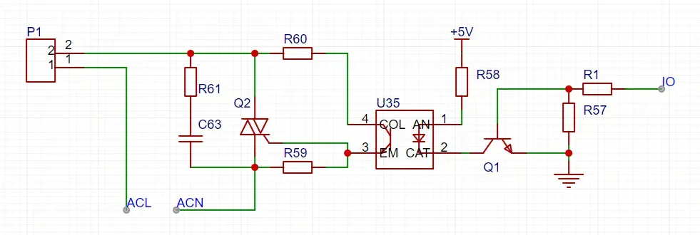
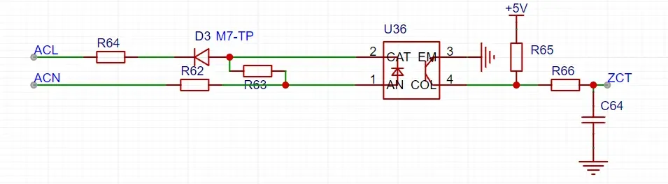
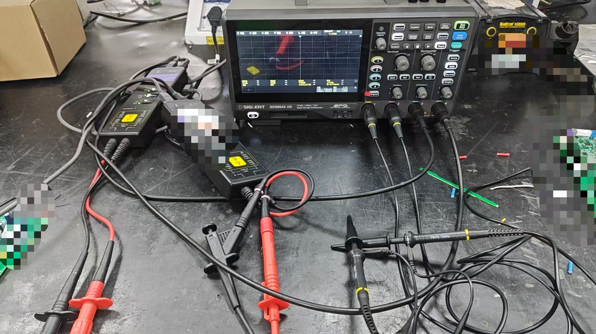
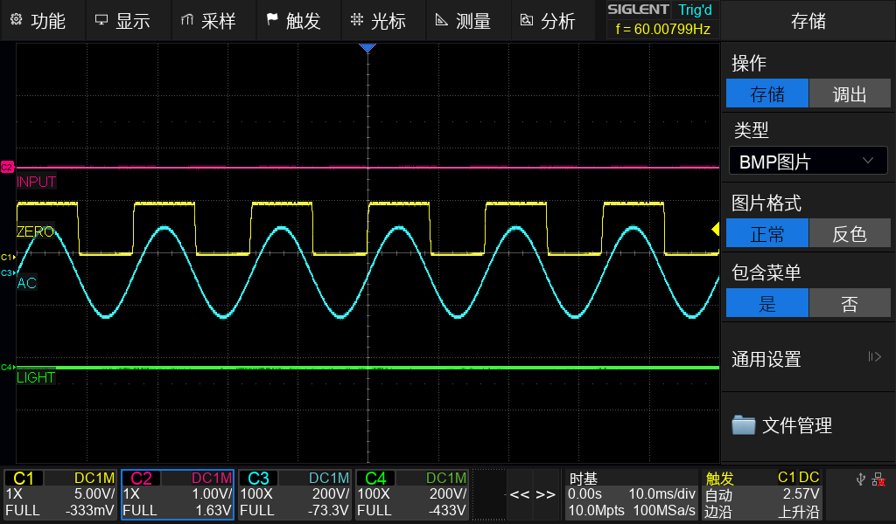
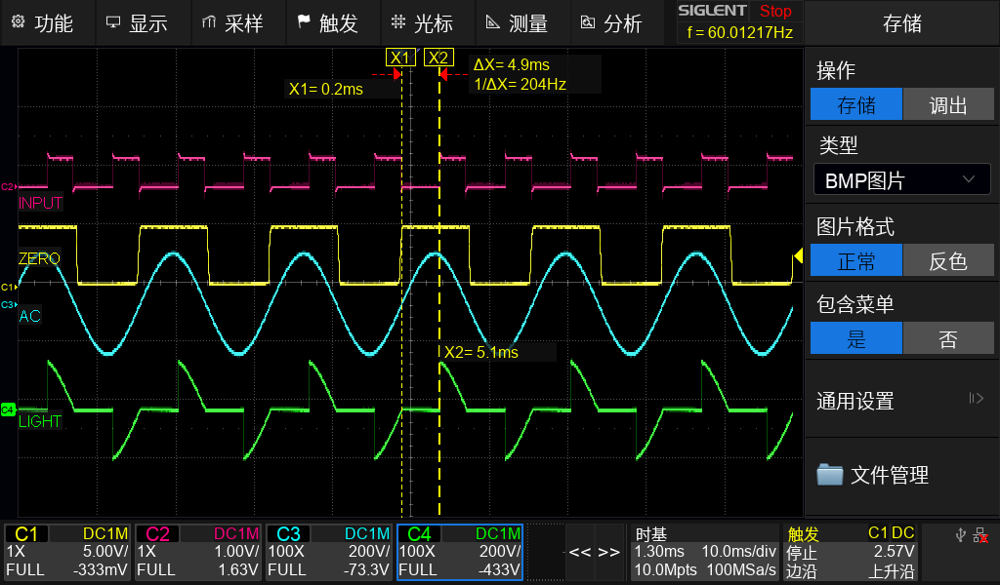
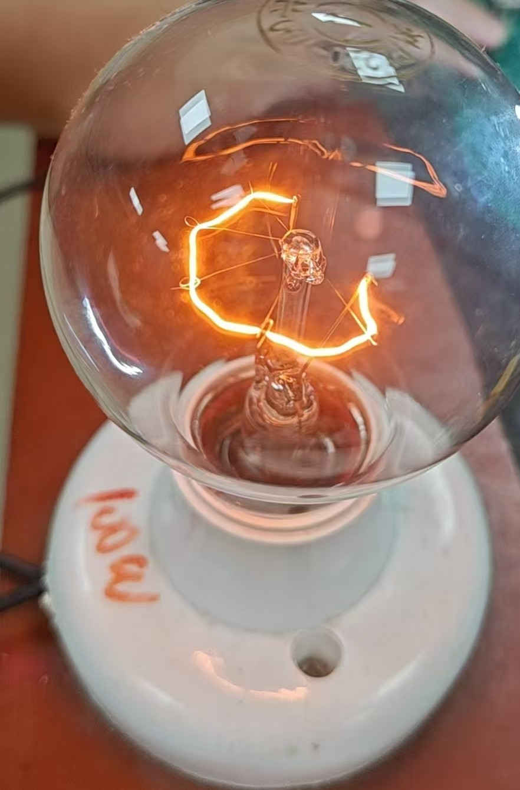
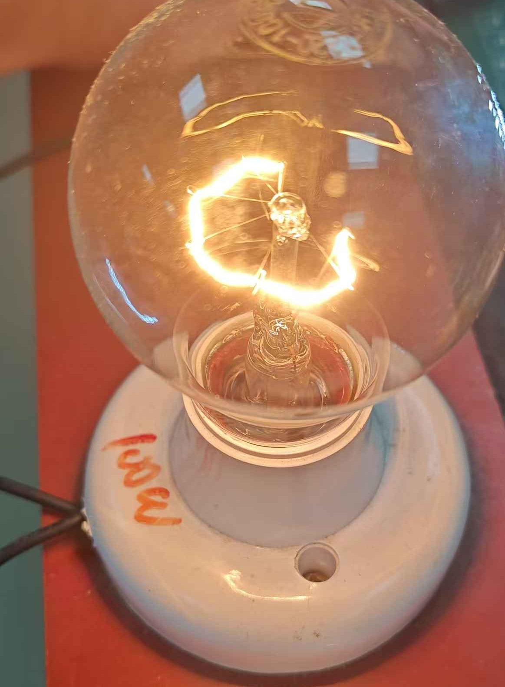
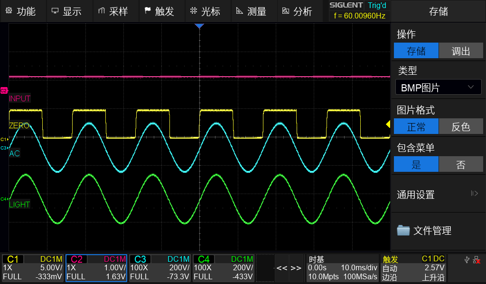
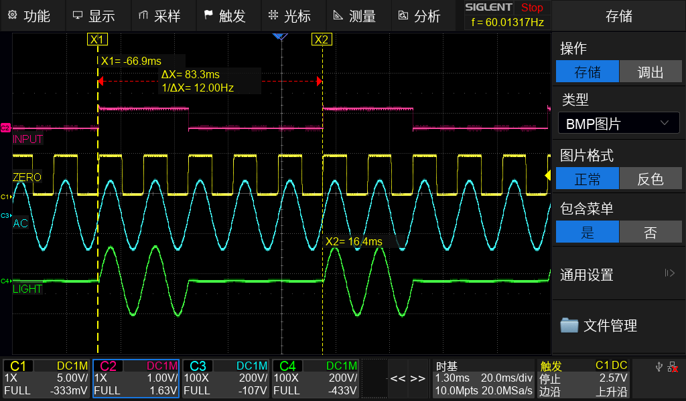
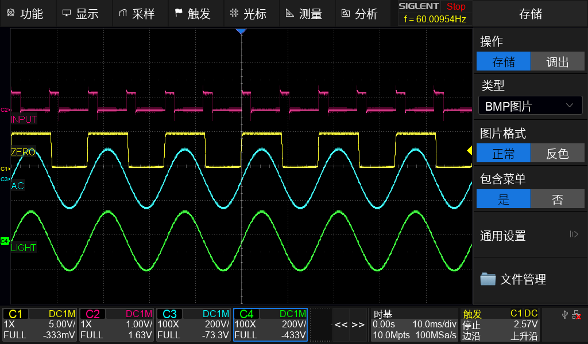

****************************************
## 引言
   本篇文章只是一个经验分享,不会涉及很多繁复的公式和底层原理,旨在希望通过分享,可以使得大家对于双向可控硅和过零电路的工作方式有一个基本的了解,我也会尽力通过文字描述和实际应用中图片相结合的方式,使文章更加便于理解.

## 一. 双向可控硅的基础知识

### 使用场景:
  
   双向可控硅是在实际生活中使用非常广泛的一种电子器件，在各位家庭中使用的家电中，很多都会使用到它，它一般作为一种开关器件，去控制负载的开关以及功率.
- 灯光调光器
- 电风扇、加热器等家用电器的无级调速/调功
- 电子开关、固态继电器等需要交流负载控制的场合

### 基本原理:
   双向可控硅（TRIAC）是一种能够在交流电路中实现双向导通和关断的半导体器件。大家看他的图标,一般它有三个电极：主电极1（MT1）、主电极2（MT2）和控制极（G）。当控制极加上触发电流时，无论交流电正半周还是负半周，主电极之间都可以导通，实现对交流负载的通断控制。

   值得注意的是，TRIAC有四种导通方式，被称为“四象限导通”，即：

| 象限 | MT2 极性 | G 极性（相对MT1） | 说明           |
| ---- | -------- | ----------------- | -------------- |
| Ⅰ    | 正       | 正                | 常用，灵敏度高 |
| Ⅱ    | 正       | 负                |                |
| Ⅲ    | 负       | 负                | 常用，灵敏度高 |
| Ⅳ    | 负       | 正                |                |

   这四种象限分别对应不同的触发极性和主电极极性组合，使TRIAC能够适应各种交流信号的控制需求。在实际应用中，最常用的是第一和第三象限的触发方式，因为这两种方式灵敏度较高，所需触发电流较小。

   之所以需要通过控制极（G）触发，是因为双向可控硅的内部结构决定了其只有在G端获得触发电流时才能导通。可以将G端类比为点火引线，即使MT1和MT2之间有较高的电压差，没有触发电流也不会导通；而当G端获得触发信号后，器件便会导通，并保持导通状态，直到电流降至维持电流以下（通常发生在交流电过零点）。由于交流电是周期性变化的，每经过一次过零点，双向可控硅都会自动关断,通过过零检测电路与其配合,我们就可以实现一些控制方式,这个我们将在下文继续介绍.

### 常用原理图分析:


   下面结合实际电路图进行说明。可以看到，电路中间部分采用了光耦作为隔离元件。光耦的作用是将强电（高压侧）与弱电（低压控制侧）有效隔离(从安全和稳定方面来说都是很有意义的).

   在该电路中，光耦的输入端是接入单片机的IO。正常情况下，单片机IO口为低电平，NPN三极管截止，光耦内部的发光二极管不工作，输出端（左侧）也不会导通。当单片机IO口输出高电平时，NPN三极管导通，带动光耦内部的发光二极管发光，进而使光耦输出端导通.

  以交流电正半周为例，当光耦导通时，T2端为正、T1端为负，控制极G的触发电流方向为G→T1，此时对应第一象限导通。而在交流电负半周时，光耦同样导通，此时T1端为正、T2端为负，G端触发电流方向为T1→G，对应第三象限导通。通过这种方式，单片机输出的控制信号经光耦隔离后，可以在交流电的正、负半周分别实现对双向可控硅的有效触发，从而实现对交流负载的可靠控制。这也是实际应用中常见的控制方法，既保证了安全性，又提升了电路的适用性和稳定性。R61与C63是RC缓冲电路,这里很有意思,根据负载的不同这里应该选择合适阻值和容值.我在使用时在这出现过一些问题,这里不做详细展开,只一笔带过.

## 二. 过零检测电路

### 基本原理:

  通过前文对可控硅的介绍，我们已经了解了其基本工作方式，也明白了“过零点”这一重要概念。要实现对可控硅的精准控制，过零检测电路是必不可少的。它不仅能判断交流电是否正常，还能检测交流电的频率。

### 常用原理图分析:


  结合上方的原理图，我们可以简要分析其工作过程。通过光耦与二极管的配合设计，使得光耦只在交流电的某一半周导通。这样，单片机（MCU）IO口的电平会随着交流电正、负半周的变化而发生跳变：当交流电为正半周时，光耦不导通，MCU的IO口被上拉至高电平；当交流电为负半周时，光耦导通，IO口被拉为低电平。因此，每当IO口出现上升沿或下降沿时，就意味着交流电经过了一个过零点。通过统计单位时间内的过零点数量，还可以进一步判断交流电的频率。

## 三. 双向可控硅与过零检测的实际应用
  OK,前面的基本原理我们已经铺垫完毕,光是理论的描述还是太枯燥了,接下来我们来介绍一些实际的应用,我会附上相关的现象图片和示波器的波形,方便大家更好的理解.下面我们来介绍三种控制方式斩波,丢波和常开.

### 1.斩波控制:
  什么是斩波呢?通过过零检测电路我们可以知道正半波和负半波的状态,如果我们在正半周和负半周的最高点去控制可控硅的导通,那么我们的负载设备是不是就相当于每个周期中都有一半的周期是上电的.是否也就相当于负载设备并没有全开,且功率只有原来的一半,接下来我们来拿示波器抓一下.





  查看上图示波器波形,INPUT为我们的IO的控制信号,ZERO为过零检测信号,AC为交流电的信号,LIGHT为负载的交流信号.

  如果我们控制的是一个交流灯的负载,那么我们控制他的功率得到的现象将会是控制了灯光的亮度.不知道各位大学时是否用过一种号称将违规电器接上去就不会跳闸的设备.以此来防止自己的小电锅把宿舍弄跳闸.其实原理就是他内部也是一个可控硅,通过可控硅控制功率来让你的宿舍功率不要超过学校的设置,但缺点也很简单,你的小电锅加热起来变慢了.

  接下来我们来实际试验一下,找一个灯泡,我们来对他进行斩波控制,以此来控制他的亮度,我们对它分为三哥档位,40%,75%,100%.那么我们只需要使可控硅在周期内的导通时间控制在40%,75%,100%.我们来依次抓一下波形.
| 档位 | 占空比 | 过零点后延迟 | 导通时间（以60Hz为例，周期16.6ms,半周8.3ms） |
| ---- | ------ | ------------ | --------------------------------------------- |
| 低   | 40%    | 5ms          | 3.3ms                                           |
| 中   | 75%    | 2ms          | 6.3ms                                           |
| 高   | 100%   | 0ms          | 8.3ms（全半周导通）                            |











  通过波形我们可以很直观的看到负载的输入波形被我们的io控制信号所控制,也可以很直观的看到灯光亮度上的差异,通过斩波的控制方式,我们可以调节灯光的亮度,电机的速度等.

### 2.丢波控制
  什么是丢波呢?我们前面已经介绍了斩波,斩波是控制周期内的导通时间来控制功率,把完整的交流波形斩的一段一段,所以被称之为斩波.丢波和他相似,但却有不同,丢波是丢掉一整个正半周和负半周.例如五个完整的交流电周期,那么我在前面两个导通,后面三个不导通.就像是丢掉了三个,那么功率也就只有原来的百分之四十,所以被称之为丢波.

  同样,我们来接一下灯泡,导通前面两个周期,丢掉后面三个.同时拿示波器抓一下,看一下此时的波形,方便大家理解丢波是一个怎样的情况.



  灯光我就不放了,因为丢波控制对于灯光的控制会有明显的闪烁.这也是斩波和丢波的一个很明显的区别.

### 3.斩波和丢波的选择
  通过上文的介绍,我们已经知道斩波和丢波是如何工作的了,那么实际应用时要如何选择斩波和丢波?

  对于电灯等照明负载，通常采用斩波控制。因为斩波是在每个交流周期的高点打开可控硅，虽然会有一定的电流冲击，但能实现平滑的亮度调节，且不会出现明显的闪烁现象。如果采用丢波控制，由于会连续丢掉若干个完整的半周，灯泡会出现肉眼可见的闪烁，影响照明体验。

  对于加热器、电热丝等热惯性较大的负载，丢波控制更为合适。加热设备对功率的瞬时变化不敏感，丢波方式不会引起闪烁，也能有效减少可控硅在高点导通时的冲击电流，提升器件寿命。

  对于电机调速，两种方式都可以用，但要根据具体需求选择。斩波控制能实现较细腻的调速，但可能会带来较大的电流脉动和噪音；丢波控制则对电机的平稳性影响较小，但调速精度有限。

  综上，斩波适合需要平滑调节、对闪烁敏感的负载（如灯光），丢波适合热惯性大或对冲击电流敏感的负载（如加热器、电机等）。选择时应结合实际负载特性和控制需求综合考虑。

### 4.常开的控制
  最简单的一种应用方式,将双向可控硅作为一个开关.那么常开,要么导通一定时间让其通过负载的电流来维持.这里不做过多描述直接上图,方便理解.




## 四. 代码编写

### 1.思路分析:

  因为拥有过零检测电路,所以我们只需要去检测IO的高低电平那么我们就知道此时是在正半周还是在负半周,同时我们记录此时的电平状态,当现在电平状态和之前电平状态不同时候我们就知道此时通过了过零点.通过两个过零点经过的时间我们可以判断是60HZ还是50HZ.之后我们就可以做更多的控制了,比如斩波和丢波.

### 2.伪代码举例

```c
uint8_t AC_Freq = 0;

/**
 * @brief 放到合适的定时器中断里去处理,比如100us.
 */
void DEV_ZERO_IRQ_Process(void)
{
    static uint8_t flag_zero = 0;
    static uint8_t cnt_level = 0;
    DEV_ZERO_Struct.FlagZero = GPIORead(HW_PIN_ZERO);
    if(flag_zero != DEV_ZERO_Struct.FlagZero) // 我们知道经过过零点了.
    {
        if(!AC_Freq)// 目前咱还不知道是60hz还是50hz的电.
        {
            if(cnt_level &gt;= 140 &amp;&amp; cnt_level &lt;= 250)// 规定个范围,看你是不是个正经交流电
            {
                if(cnt_level &lt;= 180)
                {
                    Cnt60Hz ++;
                }
                else
                {
                    Cnt50Hz ++;
                }
                if(Cnt60Hz &gt;= 20 || Cnt50Hz &gt;= 20)
                {
                    // 认为知道这个交流电的频率了.
                }
            }
        }
    }

    if(AC_Freq == 60 || AC_Freq ==50) // 已经确定AC的频率了
    {
        //在里面你想如何控制就去如何控制了,常开,不常开,斩波,丢波.

        /*后续有机会的话我会补充上去(摸了)*/
    }
    cnt_level++;
}
```

## 五. 总结
  对于双向可控硅的应用我也只是一个简单的分享,我也只是一个刚毕业一年多的助理工程师,对于双向可控硅的很多地方我也只是初步了解,在实际使用中我还遇到了不少问题.

  例如前文中的RC缓冲电路,这个缓冲电路的本身作用是起到缓冲的作用,但是如果选择不合适.出现过虽然IO已经停止控制,但是负载还在继续工作,因为电从RC那边通过了负载.还有在控制方式的选择上,对于一些小负载,他们的电压可能是120V或者220V,但是功率很小只有十几W.现象也很简单因为电流很小,又是感性负载,通过靠负载的电流维持可控硅的控制方式在这个应用上就会出现问题,对于这些小功率交流负载,我建议不要去靠负载电流维持可控硅的导通.还有一些遇到的问题我就不再去在这里展开了(因为我也还没有弄清楚原因,我的模电还得多学).

  希望我的文章能帮到你.

